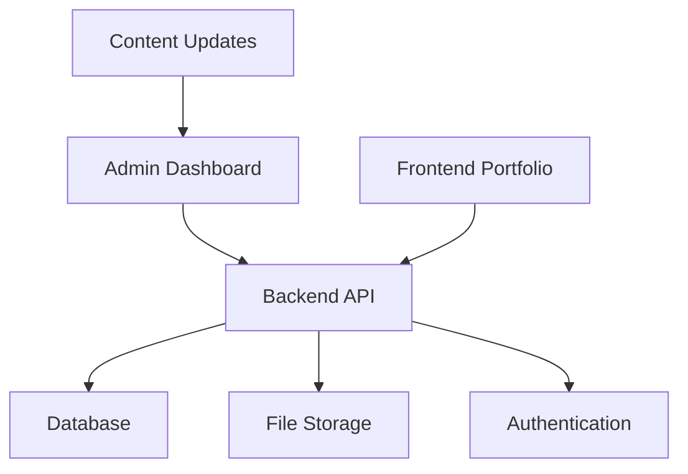
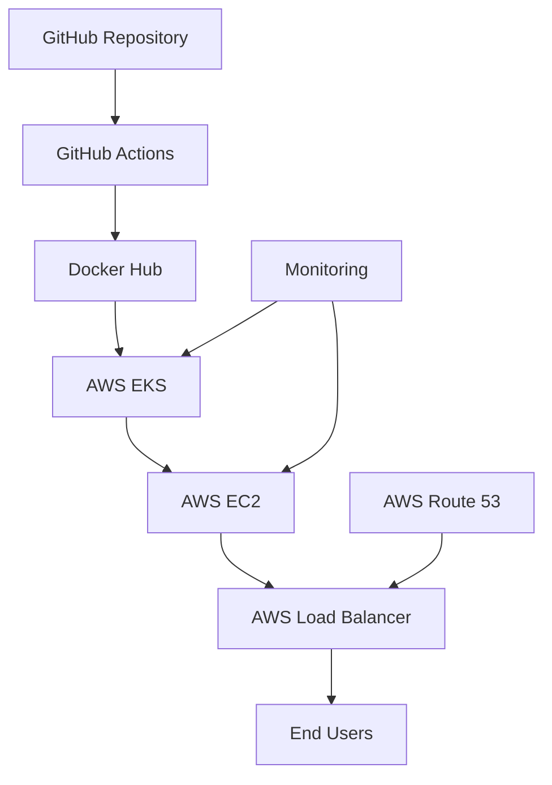
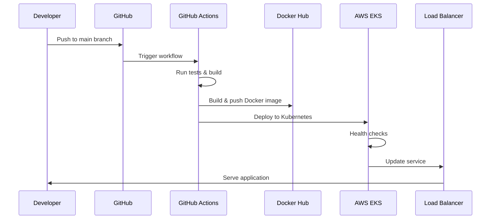

# Mbaduko - Software Developer Portfolio

A modern, responsive portfolio website built with Next.js 14, TypeScript, and Tailwind CSS. This project showcases professional experience, skills, projects, and technologies with a beautiful, interactive design.

## 🚀 Features

- **Modern Design**: Clean, professional interface with custom color scheme
- **Responsive Layout**: Optimized for all devices and screen sizes
- **Interactive Navigation**: Smooth scrolling with active section highlighting
- **Expandable Sections**: Experience and Projects with collapsible details
- **Technology Showcase**: Visual technology icons and skill categorization
- **Professional Timeline**: Chronological work experience display
- **Contact Integration**: Multiple contact methods and social links
- **Content Management**: Backend API for dynamic content updates
- **Admin Dashboard**: Web-based interface for content management

## 🛠️ Tech Stack

### Frontend
```json
{
  "framework": "Next.js 14",
  "language": "TypeScript",
  "styling": "Tailwind CSS",
  "font": "Space Grotesk (Google Fonts)",
  "features": [
    "App Router",
    "Server Components",
    "Type Safety",
    "Utility-First CSS",
    "Responsive Design"
  ]
}
```

### Development Tools
```yaml
development_tools:
  linting: ESLint
  css_processing: PostCSS
  bundler: Turbopack
  package_manager: npm/yarn
  version_control: Git
```

### Backend (Planned)
```yaml
backend_stack:
  runtime: Node.js/Express
  database: MongoDB/PostgreSQL
  authentication: JWT
  file_upload: Multer
  documentation: Swagger
  validation: Joi/Yup
  caching: Redis
```

## 📁 Project Structure

```
portfolio/
├── frontend/                    # Next.js frontend application
│   ├── src/
│   │   ├── app/
│   │   │   ├── globals.css      # Global styles and CSS variables
│   │   │   ├── layout.tsx       # Root layout component
│   │   │   └── page.tsx         # Main page component
│   │   └── components/
│   │       ├── Layout.tsx       # Main layout wrapper
│   │       ├── Header.tsx       # Navigation header
│   │       ├── Sidebar.tsx      # Profile sidebar
│   │       ├── Footer.tsx       # Footer component
│   │       └── sections/
│   │           ├── HeroBioSection.tsx
│   │           ├── SkillsSection.tsx
│   │           ├── ExperienceSection.tsx
│   │           ├── ProjectsSection.tsx
│   │           ├── TechnologiesSection.tsx
│   │           └── ContactSection.tsx
│   ├── public/                  # Static assets
│   ├── tailwind.config.ts       # Tailwind configuration
│   └── package.json             # Frontend dependencies
├── backend/                     # Express.js backend API
│   ├── src/
│   │   ├── controllers/         # Route controllers
│   │   ├── models/              # Database models
│   │   ├── routes/              # API routes
│   │   ├── middleware/          # Custom middleware
│   │   ├── utils/               # Utility functions
│   │   └── app.js               # Express app setup
│   ├── uploads/                 # File upload directory
│   └── package.json             # Backend dependencies
├── admin-dashboard/             # React admin interface
│   ├── src/
│   │   ├── components/          # Admin components
│   │   ├── pages/               # Admin pages
│   │   ├── hooks/               # Custom hooks
│   │   └── utils/               # Admin utilities
│   └── package.json             # Admin dependencies
├── docker-compose.yml           # Multi-service setup
├── k8s/                         # Kubernetes manifests
└── README.md                    # Project documentation
```

## 🚀 Getting Started

### Prerequisites

```json
{
  "node_version": "18+",
  "package_managers": ["npm", "yarn", "pnpm"],
  "git": "latest",
  "docker": "optional (for deployment)",
  "kubernetes": "optional (for deployment)"
}
```

### Installation

1. **Clone the repository**
   ```bash
   git clone https://github.com/mbaduko/portfolio.git
   cd portfolio
   ```

2. **Install dependencies**
   ```bash
   npm install
   # or
   yarn install
   ```

3. **Run the development server**
```bash
npm run dev
# or
yarn dev
   ```

4. **Open your browser**
   Navigate to [http://localhost:3000](http://localhost:3000)

## 🎨 Customization

### Color Scheme
The portfolio uses a custom dark theme defined in `src/app/globals.css`:

```css
:root {
  /* Primary Colors */
  --background: #1E1E1E;      /* Dark background */
  --foreground: #FFFFFF;      /* White text */
  --secondary-bg: #2B3036;    /* Secondary background */
  --accent-text: #9CABBA;     /* Accent text color */
  --primary-button: #0A80ED;  /* Primary button color */
}

/* Tailwind Integration */
@theme inline {
  --color-background: var(--background);
  --color-foreground: var(--foreground);
  --color-secondary-bg: var(--secondary-bg);
  --color-accent-text: var(--accent-text);
  --color-primary-button: var(--primary-button);
}
```

### Content Updates
```bash
# Profile Information
src/components/Sidebar.tsx          # Update personal details

# Experience Section
src/components/sections/ExperienceSection.tsx  # Modify work history

# Projects Section  
src/components/sections/ProjectsSection.tsx    # Edit project showcase

# Skills Section
src/components/sections/SkillsSection.tsx      # Update skills & technologies
```

## 🔧 Backend Content Management System

### Overview
A comprehensive backend system will be developed to enable dynamic content management without requiring code changes. This will allow easy updates to portfolio content through a web-based admin interface.

### Backend Architecture


### API Endpoints
```yaml
api_endpoints:
  authentication:
    POST /api/auth/login: "Admin login"
    POST /api/auth/logout: "Admin logout"
    POST /api/auth/refresh: "Refresh token"
  
  profile:
    GET /api/profile: "Get profile data"
    PUT /api/profile: "Update profile"
    POST /api/profile/avatar: "Upload avatar"
  
  experience:
    GET /api/experience: "Get all experience"
    POST /api/experience: "Add new experience"
    PUT /api/experience/:id: "Update experience"
    DELETE /api/experience/:id: "Delete experience"
  
  projects:
    GET /api/projects: "Get all projects"
    POST /api/projects: "Add new project"
    PUT /api/projects/:id: "Update project"
    DELETE /api/projects/:id: "Delete project"
    POST /api/projects/:id/thumbnail: "Upload project thumbnail"
  
  skills:
    GET /api/skills: "Get all skills"
    POST /api/skills: "Add new skill"
    PUT /api/skills/:id: "Update skill"
    DELETE /api/skills/:id: "Delete skill"
  
  technologies:
    GET /api/technologies: "Get all technologies"
    POST /api/technologies: "Add new technology"
    PUT /api/technologies/:id: "Update technology"
    DELETE /api/technologies/:id: "Delete technology"
```

### Database Schema
```sql
-- Profile Table
CREATE TABLE profiles (
  id SERIAL PRIMARY KEY,
  name VARCHAR(255) NOT NULL,
  title VARCHAR(255),
  location VARCHAR(255),
  phone VARCHAR(50),
  email VARCHAR(255),
  avatar_url VARCHAR(500),
  bio TEXT,
  created_at TIMESTAMP DEFAULT CURRENT_TIMESTAMP,
  updated_at TIMESTAMP DEFAULT CURRENT_TIMESTAMP
);

-- Experience Table
CREATE TABLE experiences (
  id SERIAL PRIMARY KEY,
  company VARCHAR(255) NOT NULL,
  position VARCHAR(255) NOT NULL,
  location VARCHAR(255),
  duration VARCHAR(100),
  short_description TEXT,
  full_description TEXT,
  technologies JSONB,
  achievements JSONB,
  start_date DATE,
  end_date DATE,
  is_current BOOLEAN DEFAULT FALSE,
  created_at TIMESTAMP DEFAULT CURRENT_TIMESTAMP,
  updated_at TIMESTAMP DEFAULT CURRENT_TIMESTAMP
);

-- Projects Table
CREATE TABLE projects (
  id SERIAL PRIMARY KEY,
  title VARCHAR(255) NOT NULL,
  description TEXT,
  short_description TEXT,
  thumbnail_url VARCHAR(500),
  live_url VARCHAR(500),
  github_url VARCHAR(500),
  technologies JSONB,
  roles JSONB,
  status VARCHAR(50),
  owner VARCHAR(255),
  featured BOOLEAN DEFAULT FALSE,
  created_at TIMESTAMP DEFAULT CURRENT_TIMESTAMP,
  updated_at TIMESTAMP DEFAULT CURRENT_TIMESTAMP
);

-- Skills Table
CREATE TABLE skills (
  id SERIAL PRIMARY KEY,
  title VARCHAR(255) NOT NULL,
  description TEXT,
  icon VARCHAR(255),
  technologies JSONB,
  category VARCHAR(100),
  created_at TIMESTAMP DEFAULT CURRENT_TIMESTAMP,
  updated_at TIMESTAMP DEFAULT CURRENT_TIMESTAMP
);

-- Technologies Table
CREATE TABLE technologies (
  id SERIAL PRIMARY KEY,
  name VARCHAR(255) NOT NULL,
  icon VARCHAR(255),
  color VARCHAR(50),
  category VARCHAR(100),
  created_at TIMESTAMP DEFAULT CURRENT_TIMESTAMP,
  updated_at TIMESTAMP DEFAULT CURRENT_TIMESTAMP
);
```

### Admin Dashboard Features
```json
{
  "dashboard_features": {
    "authentication": {
      "login": "Secure admin login",
      "session_management": "JWT token handling",
      "role_based_access": "Admin permissions"
    },
    "content_management": {
      "profile_editor": "Update personal information",
      "experience_manager": "Add/edit work experience",
      "project_manager": "Manage portfolio projects",
      "skills_manager": "Update skills and technologies",
      "media_upload": "Image and file uploads"
    },
    "user_interface": {
      "responsive_design": "Works on all devices",
      "rich_text_editor": "WYSIWYG content editing",
      "drag_and_drop": "Easy file uploads",
      "preview_mode": "See changes before publishing"
    },
    "data_management": {
      "bulk_operations": "Import/export data",
      "version_control": "Content versioning",
      "backup_restore": "Data backup functionality",
      "analytics": "Content performance metrics"
    }
  }
}
```

### Development Roadmap
```bash
# Phase 1: Backend Foundation
1. Set up Express.js server
2. Configure database connection
3. Implement authentication system
4. Create basic CRUD operations

# Phase 2: API Development
1. Build RESTful API endpoints
2. Implement file upload functionality
3. Add data validation
4. Create API documentation

# Phase 3: Admin Dashboard
1. Develop admin interface
2. Implement content editors
3. Add media management
4. Create preview functionality

# Phase 4: Integration
1. Connect frontend to API
2. Implement real-time updates
3. Add caching layer
4. Performance optimization

# Phase 5: Deployment
1. Containerize backend
2. Set up CI/CD pipeline
3. Configure monitoring
4. Production deployment
```

## 🐳 Docker & Kubernetes Deployment

### Docker Setup

The project includes Docker configuration for containerized deployment:

```dockerfile
# Dockerfile
FROM node:18-alpine AS base

# Install dependencies only when needed
FROM base AS deps
RUN apk add --no-cache libc6-compat
WORKDIR /app

# Install dependencies based on the preferred package manager
COPY package.json package-lock.json* ./
RUN npm ci

# Rebuild the source code only when needed
FROM base AS builder
WORKDIR /app
COPY --from=deps /app/node_modules ./node_modules
COPY . .

# Next.js collects completely anonymous telemetry data about general usage.
# Learn more here: https://nextjs.org/telemetry
# Uncomment the following line in case you want to disable telemetry during the build.
ENV NEXT_TELEMETRY_DISABLED 1

RUN npm run build

# Production image, copy all the files and run next
FROM base AS runner
WORKDIR /app

ENV NODE_ENV production
ENV NEXT_TELEMETRY_DISABLED 1

RUN addgroup --system --gid 1001 nodejs
RUN adduser --system --uid 1001 nextjs

COPY --from=builder /app/public ./public

# Set the correct permission for prerender cache
RUN mkdir .next
RUN chown nextjs:nodejs .next

# Automatically leverage output traces to reduce image size
COPY --from=builder --chown=nextjs:nodejs /app/.next/standalone ./
COPY --from=builder --chown=nextjs:nodejs /app/.next/static ./.next/static

USER nextjs

EXPOSE 3000

ENV PORT 3000
ENV HOSTNAME "0.0.0.0"

CMD ["node", "server.js"]
```

### Kubernetes Configuration

Kubernetes manifests for production deployment:

```yaml
# k8s/deployment.yaml
apiVersion: apps/v1
kind: Deployment
metadata:
  name: portfolio-deployment
  labels:
    app: portfolio
spec:
  replicas: 3
  selector:
    matchLabels:
      app: portfolio
  template:
    metadata:
      labels:
        app: portfolio
    spec:
      containers:
      - name: portfolio
        image: mbaduko/portfolio:latest
        ports:
        - containerPort: 3000
        resources:
          requests:
            memory: "128Mi"
            cpu: "100m"
          limits:
            memory: "256Mi"
            cpu: "200m"
        livenessProbe:
          httpGet:
            path: /
            port: 3000
          initialDelaySeconds: 30
          periodSeconds: 10
        readinessProbe:
          httpGet:
            path: /
            port: 3000
          initialDelaySeconds: 5
          periodSeconds: 5
```

```yaml
# k8s/service.yaml
apiVersion: v1
kind: Service
metadata:
  name: portfolio-service
spec:
  selector:
    app: portfolio
  ports:
    - protocol: TCP
      port: 80
      targetPort: 3000
  type: LoadBalancer
```

## 🔄 CI/CD Pipeline with GitHub Actions

### Automated Deployment to AWS EC2

The project includes a comprehensive GitHub Actions workflow for automated deployment:

```yaml
# .github/workflows/deploy.yml
name: Deploy to AWS EC2

on:
  push:
    branches: [ main ]
  pull_request:
    branches: [ main ]

jobs:
  test:
    runs-on: ubuntu-latest
    steps:
    - uses: actions/checkout@v4
    - name: Setup Node.js
      uses: actions/setup-node@v4
      with:
        node-version: '18'
        cache: 'npm'
    - name: Install dependencies
      run: npm ci
    - name: Run tests
      run: npm test
    - name: Build application
      run: npm run build

  build-and-push:
    needs: test
    runs-on: ubuntu-latest
    if: github.ref == 'refs/heads/main'
    steps:
    - uses: actions/checkout@v4
    
    - name: Set up Docker Buildx
      uses: docker/setup-buildx-action@v3
    
    - name: Login to Docker Hub
      uses: docker/login-action@v3
      with:
        username: ${{ secrets.DOCKER_USERNAME }}
        password: ${{ secrets.DOCKER_PASSWORD }}
    
    - name: Build and push Docker image
      uses: docker/build-push-action@v5
      with:
        context: .
        push: true
        tags: mbaduko/portfolio:latest
        cache-from: type=gha
        cache-to: type=gha,mode=max

  deploy:
    needs: build-and-push
    runs-on: ubuntu-latest
    if: github.ref == 'refs/heads/main'
    steps:
    - uses: actions/checkout@v4
    
    - name: Configure AWS credentials
      uses: aws-actions/configure-aws-credentials@v4
      with:
        aws-access-key-id: ${{ secrets.AWS_ACCESS_KEY_ID }}
        aws-secret-access-key: ${{ secrets.AWS_SECRET_ACCESS_KEY }}
        aws-region: ${{ secrets.AWS_REGION }}
    
    - name: Update kubeconfig
      run: aws eks update-kubeconfig --name portfolio-cluster --region ${{ secrets.AWS_REGION }}
    
    - name: Deploy to Kubernetes
      run: |
        kubectl apply -f k8s/
        kubectl rollout restart deployment/portfolio-deployment
        kubectl rollout status deployment/portfolio-deployment
```

### Required Secrets

Configure these secrets in your GitHub repository:

```yaml
# GitHub Repository Secrets
secrets:
  docker:
    DOCKER_USERNAME: "your-dockerhub-username"
    DOCKER_PASSWORD: "your-dockerhub-token"
  
  aws:
    AWS_ACCESS_KEY_ID: "your-aws-access-key"
    AWS_SECRET_ACCESS_KEY: "your-aws-secret-key"
    AWS_REGION: "us-east-1"  # or your preferred region
```

## 🚀 Deployment Architecture

### Infrastructure Components



```yaml
infrastructure:
  source_control: GitHub Repository
  ci_cd: GitHub Actions
  container_registry: Docker Hub
  orchestration: AWS EKS (Kubernetes)
  compute: AWS EC2 Worker Nodes
  load_balancing: AWS Load Balancer
  dns: AWS Route 53 (optional)
  monitoring: AWS CloudWatch
```

### Deployment Flow



```bash
# Deployment Steps
1. git push origin main                    # Trigger deployment
2. GitHub Actions runs tests              # Automated testing
3. Docker image built & pushed            # Container creation
4. Kubernetes deployment updated          # Orchestration
5. Health checks performed               # Validation
6. Traffic routed to new version         # Zero-downtime deployment
```

## 📊 Monitoring & Logging

### Health Checks
```yaml
health_checks:
  liveness_probe:
    path: "/"
    port: 3000
    initial_delay: 30s
    period: 10s
    timeout: 5s
    failure_threshold: 3
  
  readiness_probe:
    path: "/"
    port: 3000
    initial_delay: 5s
    period: 5s
    timeout: 3s
    failure_threshold: 3
  
  resource_monitoring:
    cpu_requests: "100m"
    cpu_limits: "200m"
    memory_requests: "128Mi"
    memory_limits: "256Mi"
```

### Logging
```bash
# Application Logs
kubectl logs -f deployment/portfolio-deployment

# Container Logs
docker logs portfolio-container

# Kubernetes Events
kubectl get events --sort-by='.lastTimestamp'

# Resource Usage
kubectl top pods
kubectl top nodes
```

## 🔧 Development Commands

```bash
# Development
npm run dev          # Start development server
npm run build        # Build for production
npm run start        # Start production server
npm run lint         # Run ESLint

# Docker
docker build -t portfolio .     # Build Docker image
docker run -p 3000:3000 portfolio  # Run container locally

# Kubernetes
kubectl apply -f k8s/           # Deploy to cluster
kubectl get pods                # Check pod status
kubectl logs -f deployment/portfolio-deployment  # View logs
```

## 🤝 Contributing

1. Fork the repository
2. Create a feature branch (`git checkout -b feature/amazing-feature`)
3. Commit your changes (`git commit -m 'Add amazing feature'`)
4. Push to the branch (`git push origin feature/amazing-feature`)
5. Open a Pull Request

## 📄 License

This project is licensed under the MIT License - see the [LICENSE](LICENSE) file for details.

## 📞 Contact

```json
{
  "personal_info": {
    "name": "Clement NSENGIYUMVA",
    "title": "Software Developer",
    "location": "Kigali, Rwanda",
    "phone": "+250 791 130 583",
    "email": "nsengiyumvaclement247@gmail.com"
  },
  "social_links": {
    "github": "https://github.com/mbaduko",
    "linkedin": "https://linkedin.com/in/mbaduko",
    "portfolio": "https://mbaduko.dev"
  },
  "availability": {
    "status": "Open to opportunities",
    "response_time": "Within 24 hours"
  }
}
```

---

Built with ❤️ using Next.js, TypeScript, and Tailwind CSS
